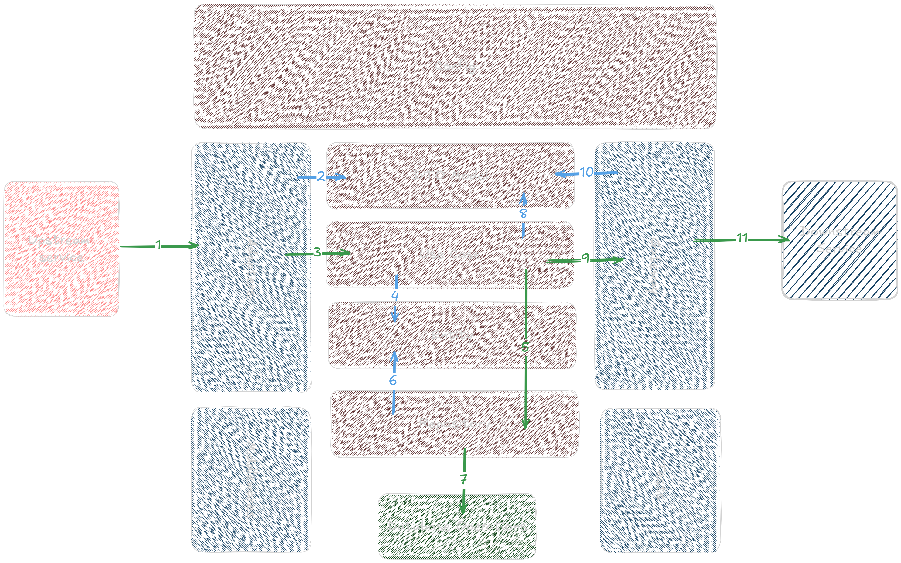

Oke! Aku update README-nya biar include **Zod** untuk validation & parsing data juga, yang makin populer dipakai bareng NestJS.

---

# NestJS Clean Architecture Template

## Description

This is a NestJS clean architecture template with Zod validation.

## Architecture



1. External systems (HTTP, gRPC, Messaging, etc.) send requests to the system through an Adapter.
2. The Adapter creates various DTO (Data Transfer Object) models from the request data.
3. The Adapter calls the Use Case and executes it using data from the DTO models.
4. The Use Case creates Entities to process the business logic.
5. The Use Case calls the Repository Interface and executes it using data from the Entities.
6. The Repository Interface is directed to the Infrastructure Repository implementation.
7. The Infrastructure Repository uses data from the Entities to perform operations on the Database.
8. Database operations are executed to store or retrieve data from the Database.
9. The Use Case (if necessary) creates various Models to be sent to the Gateway or as results from the Entities.
10. The Use Case calls the Gateway Interface and executes it using data from the Models.
11. The Gateway Interface is directed to the Infrastructure Gateway implementation.
12. The Infrastructure Gateway uses data from the Models to build requests to the External System.
13. The External System receives requests from the Gateway (via HTTP, gRPC, Messaging, etc.).

## Tech Stack

* **NestJS** : [https://nestjs.com](https://nestjs.com)
* **PostgreSQL** (Database) : [https://www.postgresql.org/](https://www.postgresql.org/)
* **TypeORM** (ORM) : [https://typeorm.io/](https://typeorm.io/)
* **Zod** (Schema Validation) : [https://zod.dev/](https://zod.dev/)

## Framework & Library

* **NestJS** (Backend Framework) : [https://nestjs.com/](https://nestjs.com/)
* **TypeORM** (ORM) : [https://typeorm.io/](https://typeorm.io/)
* **Zod** (Validation & Parsing) : [https://zod.dev/](https://zod.dev/)
* **Jest** (Testing) : [https://jestjs.io/](https://jestjs.io/)
* **Swagger** (API Documentation) : [https://swagger.io/](https://swagger.io/)

## Configuration

Configuration is handled via `.env` files using the `@nestjs/config` module.

## API Spec

All API specifications are documented and available via Swagger at `/api`.

## Database Migration

Database migrations are managed using **TypeORM CLI** and stored in the `src/migrations` folder.

### Create Migration

```bash
npm run typeorm migration:generate -- -n CreateTableXxx
```

### Run Migration

```bash
npm run typeorm migration:run
```

## Run Application

### Run unit tests

```bash
npm run test
```

### Run the web server (development)

```bash
npm run start:dev
```

### Run the web server (production)

```bash
npm run start:prod
```

---

Kalau perlu, aku juga bisa bantu buatkan contoh integrasi **Zod** di controller dan service NestJS, atau contoh DTO dengan Zod schema. Mau?
